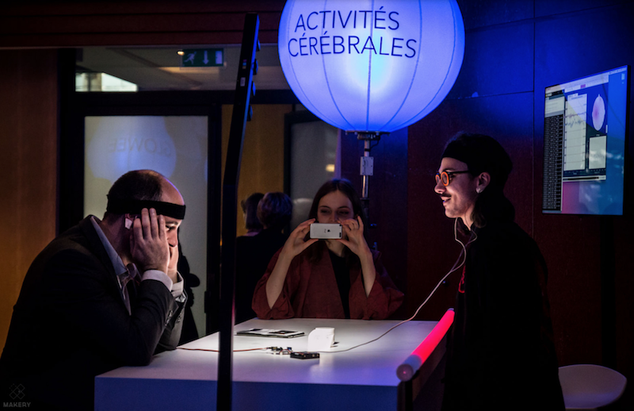

### – Brain Battle

Deux participants se retrouvent face à une barre de leds bicolore, chacune des couleurs est assigner à une personne.

L'objectif est de remplir de sa couleur la barre de leds. L'enjeu pour les adversaires et d'allumer les leds une par une grâce à leurs pensée : faire le vide et de se focaliser sur la seul idée d'allumer les leds.

